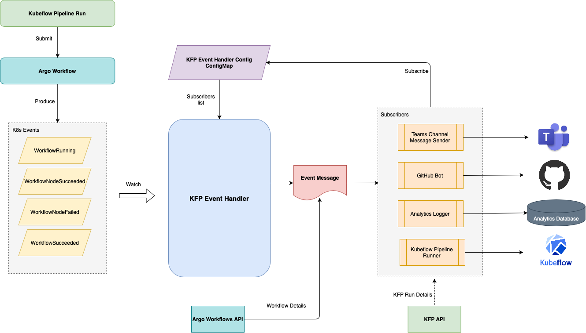

# Kubeflow Pipelines Event Handler

This microservice is an extension to [Kubeflow Pipelines](https://github.com/kubeflow/pipelines). It notifies a list of subscribers on the Kubeflow Pipeline Run events.

This repo implements (KFP Execution events)[https://github.com/kubeflow/pipelines/issues/4079] proposal and will be removed once [Kubeflow Pipelines](https://github.com/kubeflow/pipelines) provide native support of KFP execution events. 



When a KFP run starts it submits an Argo Workflow CRD and delegates the pipeline execution to it. Argo Workflow (v2.8.0+) produces K8s events corresponding to the execution stages of the workflow such as "Workflow Started", "Node Succeeded", "Workflow Failed", etc. KFP Event Handler watches those events in its namespace.

Once a new event comes up, the event handler:
 * identifies the workflow that produced the event
 * invokes Argo Workflow API to get the workflow details (e.g. KFP_RUN_ID, parameters, etc.)
 * creates a json message containing the event and workflow details
 * iterates over the list of subscribers and sends the message to each of the with a POST request

 Each subscriber knows how to parse the event message and how to notify its backend system. An example of a subscriber could be a Teams Chanel Message Sender that sends message cards to Teams, a GitHub Bot that notifies a CI pipeline on the result of KFP execution, an Analytics logger that saves execution data to an analytics database, a KFP runner that starts another pipeline once this one has finished.

 If a subscriber needs more details on the KFP run, it may request those details with KFP API before invoking its backend system.  

## Build and Deploy
* Build and push an image with this [Dockerfile](src/Dockerfile)
* Update [kfp-event-handler.yaml](src/kfp-event-handler.yaml) with your image name and tag
* Apply [kfp-event-handler.yaml](src/kfp-event-handler.yaml) to the namespace where you run your Kubeflow pipelines


## Subscribe on Events
To subscribe on KFP events add an entry to *kfp-event-handler-config* ConfigMap (defined in [kfp-event-handler.yaml](src/kfp-event-handler.yaml)) with an endpoint URI. The endpoint must accept POST requests with the following payload:
```
{
 "KfpRunId":"ee1c3f1f-031b-49e9-a7ff-2f7a54c11b95",
 "WorkflowName": "tacos-vs-burritos-vw8g9",
 "NodeName": "dataprocessing",
 "EventType":"WorkflowNodeSucceeded",
 "Message":"Succeeded node tacos-vs-burritos-vw8g9.dataprocessing"
}
```

### Currently supported event types:
Event                 | Occurs when
----------------------|-----------------------------------------------
WorkflowRunning       | KFP Run starts           
WorkflowFailed        | KFP Run is failed or terminated 
WorkflowSucceeded     | KFP Run successfully finishes   
WorkflowNodeFailed    | KFP Step fails                 
WorkflowNodeSucceeded | KFP Step successfully finishes  


## Enjoy!
